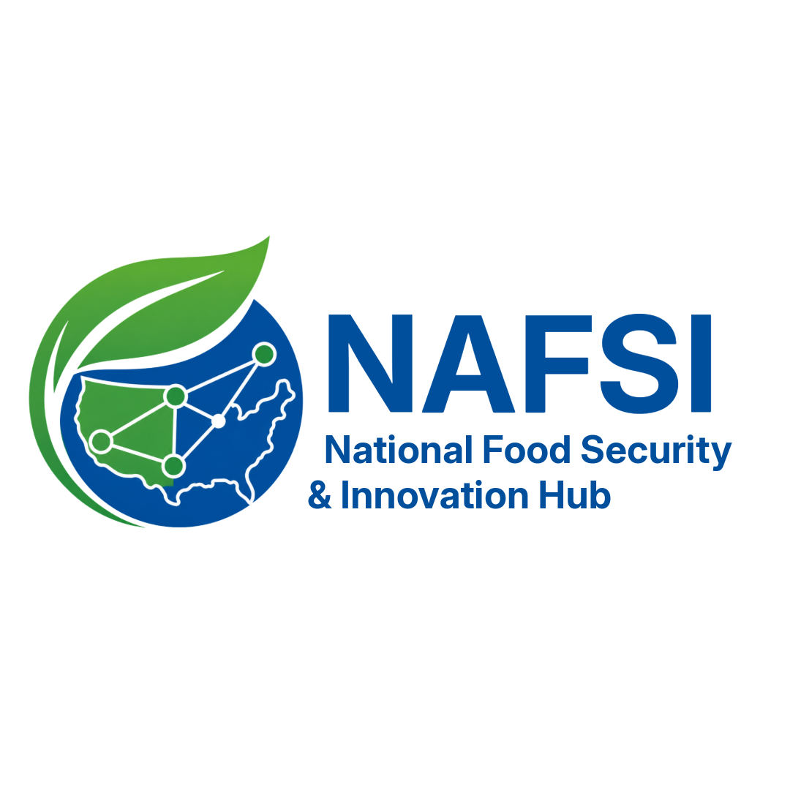

# NAFSI Hub Documentation

The National Food Security and Innovation (NAFSI) Hub: a convergence platform for translating science into solutions for sustainable futures.

## About

The [National Food Security & Innovation (NAFSI) Hub](https://nafsihub.org/) advances food security by unifying the nation’s most impactful food systems data and solutions into one powerful, accessible hub. Our mission is to accelerate innovation, foster cross-sector collaboration, and empower researchers, industry, policymakers, and communities with cutting-edge data, tools, and insights to build resilient, sustainable food systems.

NAFSI is the central data hub serving Food & Nutrition Security Phase 2 projects funded by the [NSF Directorate for Technology, Innovation and Partnerships (TIP)](https://www.nsf.gov/tip/latest). We aggregate and steward diverse, high-impact datasets produced by seven groundbreaking, cross-disciplinary teams. These assets include real-time sensor outputs, AI/ML tools, digital twins, and geospatial dashboards—managed with varying levels of security and privacy to meet industry needs. By standardizing and centralizing these resources, NAFSI enables seamless access to data-driven solutions that accelerate discovery and drive meaningful impact across the food security landscape.

The NAFSI Hub was developed on the [National Data Platform](https://nationaldataplatform.org/), an NSF-funded federated and extensible data ecosystem to promote collaboration, innovation, and use of data on top of existing cyberinfrastructure capabilities.

!!! info
    The Wildfire Science & Technology Commons is a UC San Diego initiative funded by the National Institute of Standards and Technology (NIST). Special thanks to Senator Alex Padilla (D-CA) and Representatives Juan Vargas (CA-52) and Sara Jacobs (CA-51) for their support of this project through the Congressional appropriations process.

